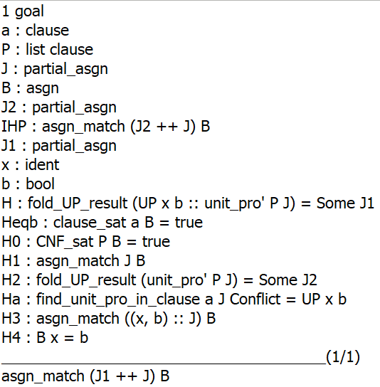

资料提供了五个引理: `find_unit_pro_in_clause_Conflict`, `find_unit_pro_in_clause_Conflict_UP`, `clause_filter_sat`, `CNF_sat_pick_fail`, `DPLL_UP_false_Jsat` 和最终的目标定理 `DPLL_sound`. 我们证明了前四个引理，并利用引理五证明了目标定理, 但在证明引理五 `DPLL_UP_false_Jsat` 时, 我们利用了新引入的引理 `unit_pro_keep_match`, 该引理的一个情况 (见下图) 未能证明, 但我们确信证明其的思路是可行的.
具体地, 在 `J: partial_asgn` 上, 对 `P: CNF` 进行单子句传播, 得到的结果是 `Some J2: option partial_asgn`; 对 `a :: P: CNF` 进行单子句传播, 得到的结果是 `Some J1: option partial_asgn`. 而对`a: clause` 进行单子句传播, 得到的结果是 `UP x b: UP_result`. 此外, 已知 `J2 ++ J` 匹配 `B: asgn`, 且 `B x = b`. 需要证明 `J1 ++ J` 匹配 `B`. 这是我们唯一未完成的证明, 并且我们确信该命题是正确的.

